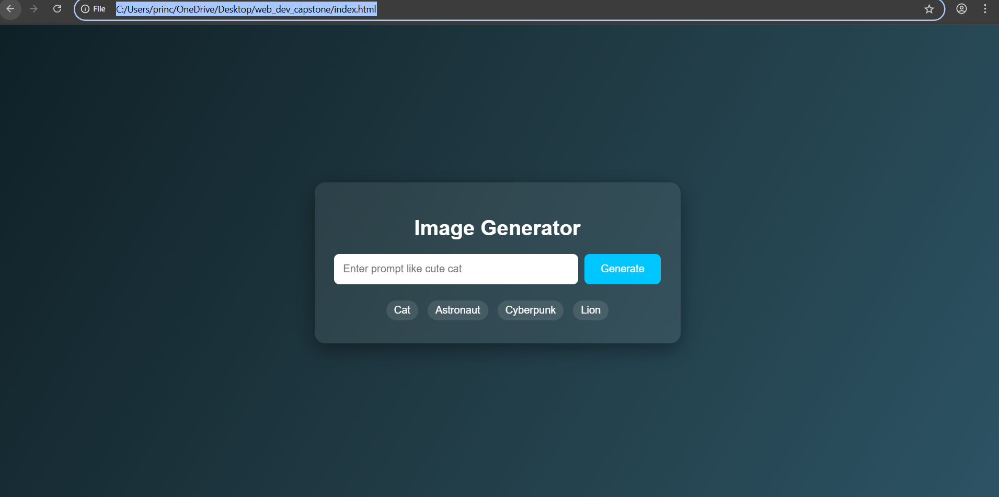
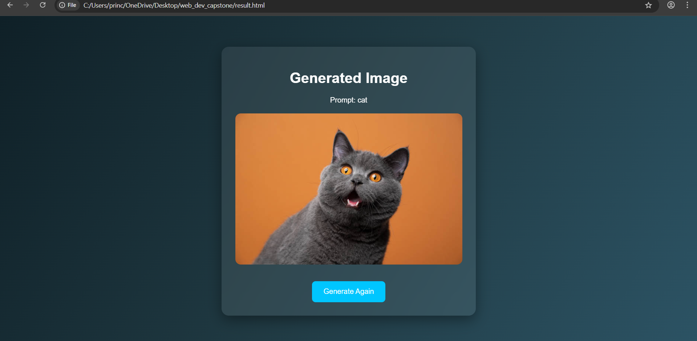

# 🤖 AI Image Generator (Frontend Prototype)

## 📌 Project Overview

The ** Image Generator** is a frontend-based web application that simulates how an  image generation system works and in future also become ai based.
Users can enter a text prompt such as *" cat"* or *"cyberpunk city"* and the system displays a corresponding generated image.

This project demonstrates the working flow of real-world AI image generation platforms like Stable Diffusion and DALL·E using a **static prompt–image mapping approach**.

---

## 🚀 Features

* Prompt based image generation
* Multi-page navigation (Prompt Page → Result Page)
* Modern Dark Glass UI (Glassmorphism)
* Prompt suggestions for quick testing
* Offline working (No API / No Internet required / API and ai based in future)
* LocalStorage used for prompt transfer between pages
* Responsive layout
* Clean and simple architecture

---

## 🛠️ Technologies Used

* HTML5
* CSS3 (Glassmorphism UI)
* JavaScript (DOM Manipulation & LocalStorage)

---

## 📂 Project Structure

```
ai-image/
│
├── index.html        (Prompt input page)
├── result.html       (Image display page)
├── style.css         (UI design)
├── script.js         (Application logic)
│
└── images/
      cat.jpg
      astronaut.jpg
      cyberpunk.jpg
      lion.jpg
```

---

## ⚙️ How It Works

1. User enters a text prompt.
2. The prompt is saved using **LocalStorage**.
3. The application redirects to the result page.
4. Based on the prompt keywords, a trained image is displayed.
5. If no matching prompt is found, a message is shown.

---

## ▶️ How to Run the Project

1. Download or clone the project folder.
2. Open `index.html` in any modern web browser.
3. Enter prompts like:

* cute cat
* astronaut in space
* cyberpunk city
* lion in jungle

4. Click **Generate** to see the result.

---

## 🧠 Future Enhancements

* Real AI Image Generation API Integration
* Multiple image results grid
* Download generated image feature
* Image history storage
* Loading animation and progress bar
* Backend integration using Node.js / Express
* Deployment on Netlify / Render

---

## 📸 Screenshots

### 🏠 Prompt Page



### 🖼️ Result Page



---

## 🎓 Academic Purpose

This project is developed as a **Web Development Capstone Project** to demonstrate understanding of:

* Frontend architecture
* User interaction flow
* Dynamic content rendering
* UI/UX design principles
* Simulation of AI based systems

---

## 👨‍💻 Author

**Prince Tiwari**

---
